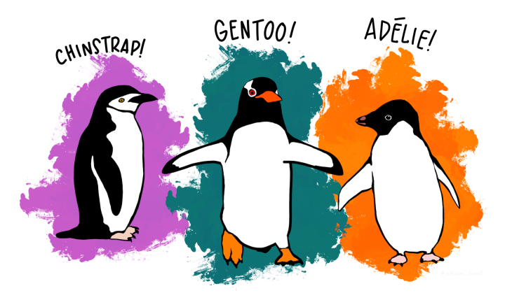

# Basics

## Introduction

```{r setup, include = FALSE}
library(moodlequiz)
knitr::opts_chunk$set(echo = FALSE)
```

**Meet the penguins!**



> The `palmerpenguins` data contains size measurements for three penguin species observed on three islands in the Palmer Archipelago, Antarctica.

```{r data, echo = TRUE}
library(palmerpenguins)
penguins
```

## Plotting weight

**Which penguins are heaviest?**

A summary of the penguins dataset is shown below.

```{r}
summary(penguins)
```

The average weight of a penguin is `r cloze(mean(penguins$body_mass_g, na.rm = TRUE), tolerance = 1)`, which is slightly `r cloze("more", c("more", "less"))` than the median weight of `r cloze(median(penguins$body_mass_g, na.rm = TRUE), tolerance = 1)`.

Complete the code to produce the graphic shown in figure \@ref(fig:boxplot).

```r
library(ggplot2)
penguins |> 
  ggplot(aes(x = `r cloze("body_mass_g", colnames(penguins))`, y = `r cloze("species", colnames(penguins))`, fill = `r cloze("species", colnames(penguins))`)) +
  `r cloze("geom_boxplot")`() +
  scale_fill_manual(values = c("darkorange","darkorchid","cyan4")) + 
  theme_minimal()
```

```{r boxplot, fig.cap="Boxplots of penguin weight by species"}
library(ggplot2)
penguins |> 
  ggplot(aes(x = body_mass_g, y = species, fill = species)) +
  geom_boxplot() +
  scale_fill_manual(values = c("darkorange","darkorchid","cyan4")) + 
  theme_minimal()
```

Modify the code to investigate differences in `species` weight by `sex` that produces figure \@ref(fig:boxplot-sex).

```r
library(ggplot2)
penguins |> 
  ggplot(aes(x = `r cloze("body_mass_g", colnames(penguins))`, y = `r cloze("sex", colnames(penguins))`, fill = `r cloze("species", colnames(penguins))`)) +
  `r cloze("geom_boxplot")`() +
  scale_fill_manual(values = c("darkorange","darkorchid","cyan4")) + 
  theme_minimal()
```

```{r boxplot-sex, fig.cap="Boxplots of penguin weight by species and sex"}
penguins |> 
  ggplot(aes(x = body_mass_g, y = sex, fill = species)) +
  geom_boxplot() +
  scale_fill_manual(values = c("darkorange","darkorchid","cyan4")) + 
  theme_minimal()
```

Male penguins `r cloze("tend to", c("almost always", "tend to"))` weigh `r cloze("more", c("more", "less"))` than female penguins. Within each species, male penguins `r cloze("almost always", c("almost always", "tend to"))` weigh `r cloze("more", c("more", "less"))` than female penguins.

## Telling the story {type=essay}

**Tell the story**

Write a short paragraph about how a penguin's weight relates to their species and sex.
